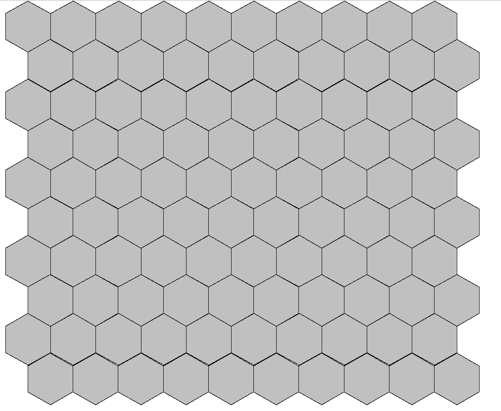
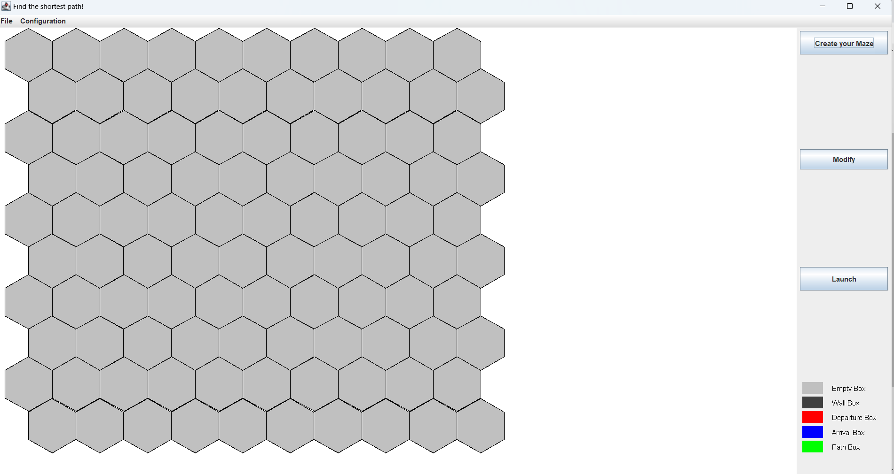
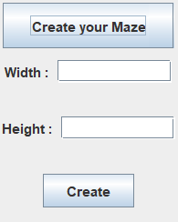
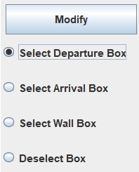
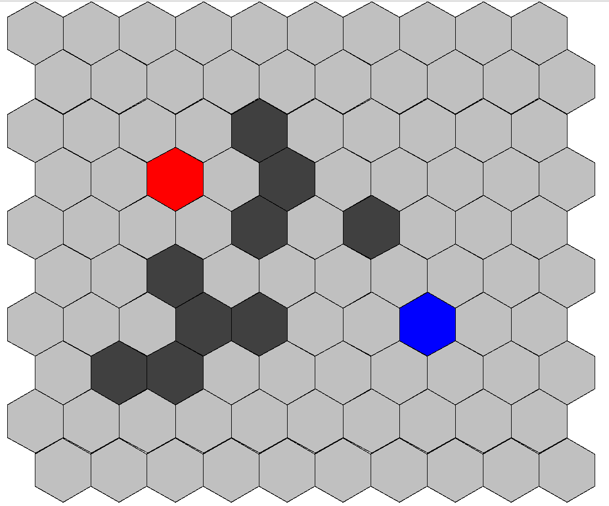
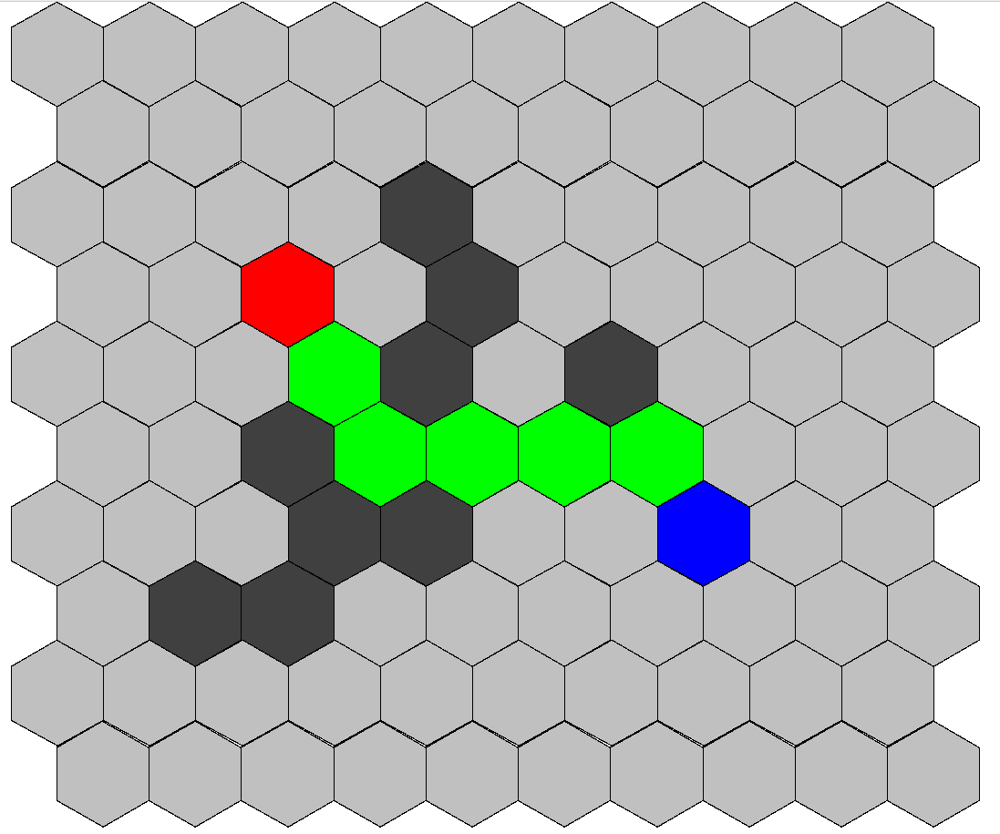
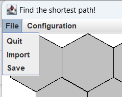
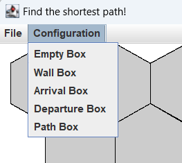
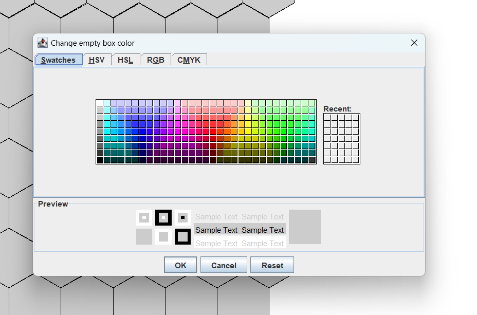

# Maze Game - Find the shortest path!
In this application, you can create a hexagon maze by giving its width and its height. By setting the starting point and end point, a shortest path will be shown on maze. There is also possibility to choose wall box where the path will be blocked. 

This application is fully developped with [Java](https://www.java.com/en/) and it uses Java Swing for interface.

## Summary
- [What is the aim of project?](#what-is-the-aim-of-project-)
- [How to run and use this application?](#how-to-run-and-use-this-application-)
- [Tips of usage](#tips-of-usage)

## What is the aim of project?
The goal of the project is to use implementation of Dijkstra's algorithm to solve a hexagonal maze and to provide a shortest path. Figure below shows an example of hexagonal maze with dimension of 10x10.

Every odd-numbered row is shifted to the right and every hexagon case has 6 neighbors surrounding it.

The project consists of a graphical interface where users will be able to configure his labyrinth with its entry and exit points, launch the Dijkstra algorithm and display the result. The maze configured can be saved in a file and be imported for reusage.

The main functions of this applcation are:
- Create an empty labyrinth by giving its dimension.
- Choose entry point and exit point by clicking directly on the hexagon case.
- Choose some wall case where path is not allowed.
- Launch Dijkstra and display shortest path on maze.
- Save edited maze in text file.
- Import maze 

## How to run and use this application?
1. Download this application with git clone.
2. In folder projetJava, go to folder src and run "MainFenetre.java" with an environment IDE (Eclipse prefered). An application interface appear as figure below.

3. Click on "Create your Maze" button and give height and width to create an empty labyrinth.

4. A labyrinth is created with dimension given on the left side of window. All cases are empty by default. Click on "Modify" button. There are four radio buttons as options:
    - Select Departure box
    - Select Arrival box
    - Select Wall box
    - Deselect Box
    

Choose one of the options depending your action. Click on the case where you want to change its type and the cases change its color depending on its type.

Color panel indicating the four colors for four types of boxes (departure, arrival, wall, empty) is shown on right bottom side of window.

5. Click on "Launch" button to launch Dijkstra algorithm to show shortest path.

6. Click on "File" menu and "Save" item to save your labyrinth in text file.

7. Import your labyrinth to reuse it by clicking on "Import" in "File" menu.

8. You may modify color of the four types of boxes by clicking on "Configuration" menu.

  

